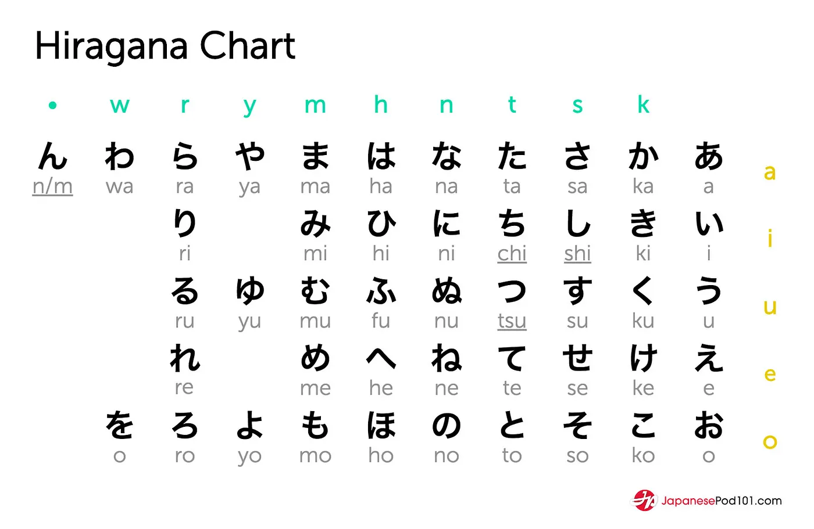
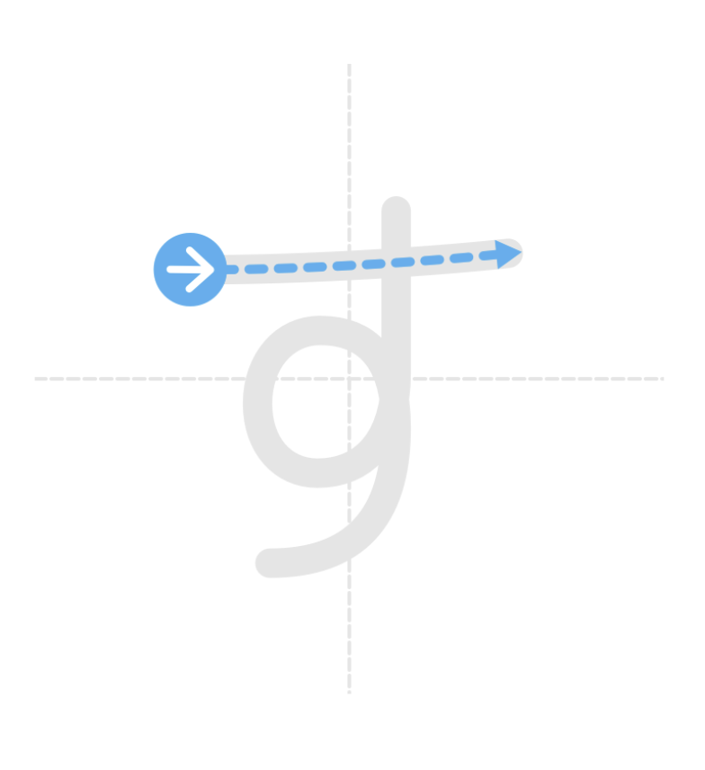
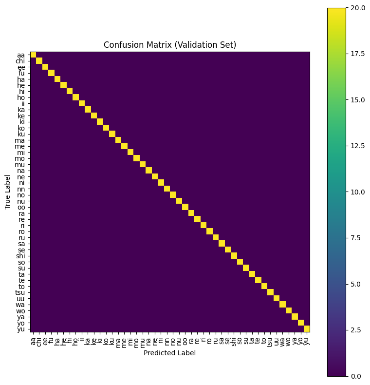
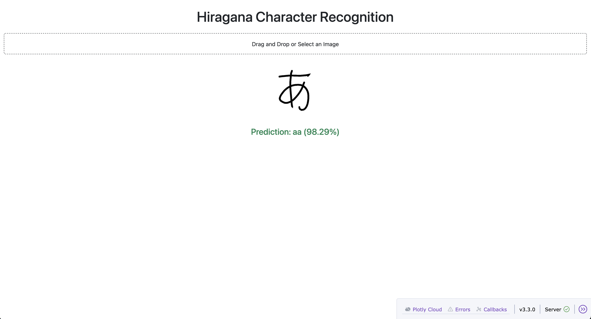

# Hiragana prediction using convolutional neural network

## Table of Contents
- [About](#about)
- [Goal](#goal)
- [Convolutional Neural Network](#convolutional-neural-network)
- [Installation](#installation)
- [Usage](#usage)
- [Author](#author)

## About <a name= "about"></a>
Learning Japanese opens the door to a rich language and culture shaped by unique characters. Japanese uses three writing systems—hiragana, katakana, and kanji—each with its own role. Together they form the foundation for learning Japanese.


There are 46 hiragana and the dataset is composed of 100 images of each of the 46 hiraganas. 


<p align="center">
  
</p>

Writing the characters involves a series of strokes that goes from top to bottom.


<p align="center">
  
</p>


## Goal <a name= "goal"></a>
The goal of this project is to enable the user to identify hiraganas by uploading images in the app, displaying a prediciton score and the romaji transcription, allowing non-japanese readers to understand how it should be pronounced.

## Convolutional Neural Network <a name= "CNN"></a>
**Data Augmentation**

Data augmentation implies resizing, rotating, scaling, using a grayscale, then converting the image into a Pytorch tensor to make it suitable for the model. Finally the images are all normalized to have the same pixel intensity.

**Load images and stratify train/test split**

The dataset was split into train and validation sets usinng a stratified method to have each class represented and a seed to make it reproducible. In that case, this is a multiclass image classification task.
the train and validation sets were created using `DataLoader` and shuffling in the training set to have a random mix order of the characters and avoid overfitting.

**Model Definition**

The model is a convolutional neural network that takes a 64*64 grayscale image as input. It has 3 convolutional blocks and 46 classes. The tensor shape after the convolutional layers is 128 * 8 * 8, which is tthe total number of features taken as input neurons. 512 corresponds to the number of output neurons. The fully connected layer uses `Sequential` and `ReLU`, combining the different features and classifying the character into one of the 46 Hiragana classes. `Dropout` is used to avoid overfitting. It randomly turns off neurons during training and in this case, p=0.5 means that 50% of the neurons are temporarily turned off (set to zero) during each training step. This is supposed to prevent the model to memorize specific drawings by making it learen the features. During the evaluation, this dropout is not used and all neurons are used.
The final output layer is thus 46, the number of classes.


**Training**

During the training phase and the 15 epochs, the model passes through the training set to learn. The batch size, 32 images, is set at the beginning of the notebook. During the forward pass, one image produces 46 scores for each of the classes. The loss is computed usinng the `CrossEntropyLoss` and the Adam optimizer is used to adjust weights for predictions and is also set at the beginning of the notebook.


**Prediction**

The `predict_image` function is using ` val_transform`, processing the images without augmentation (rotating, shifting etc...) since augmentation is only needed in the learning phase.
In the `predict_image` function, an image from the validation set or a new image of a hiragana can be used.


<p align="center">
  
</p>


## Installation <a name= "installation"></a>
### Pre-requisites

To run the notebook you need an environment with `torch`, `tqdm`, `scikit-learn` and `matplotlib`.


For the app you can use uv:

```
uv init
uv venv --python 3.11
uv pip install torch==2.2.2 torchvision==0.17.2
uv pip install flask dash dash-bootstrap-components
uv pip install pillow
uv pip install "numpy<2"
```


## Usage <a name= "usage"></a>

```
uv run app.py
```
After choosing an image to predict, you should see this:
<p align="center">
  
</p>

The prediction returns a confidence value showing how sure the model is of the prediction and corresponding to the highest score for one of the 46 hiraganas.

## Author <a name= "author"></a>

Pauline Dao